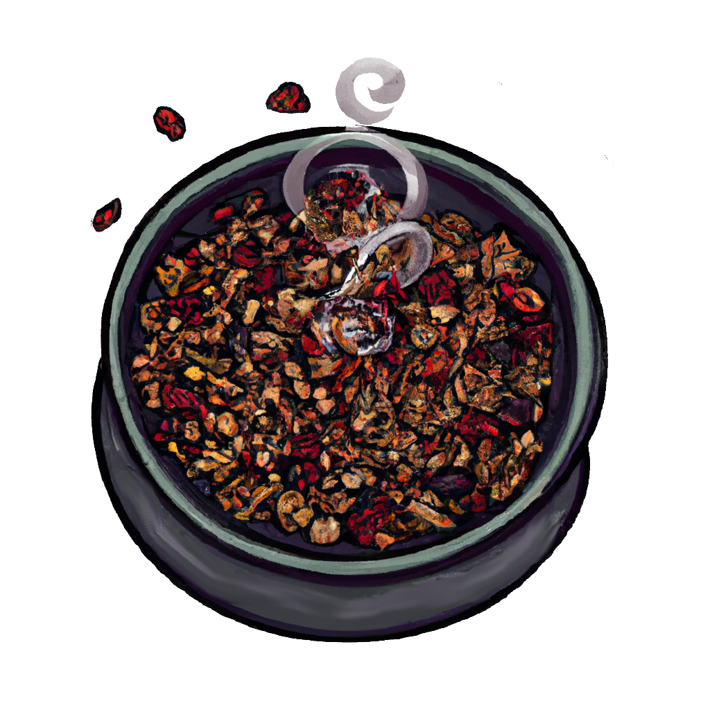

<h1 align="center">
Granola:
</h1>

Granola is a Python library for building apis and backend applications, with an emphasis on reusability and horizontal scaling.

## Features

- Built for python, a popular and versatile programming language that is easy to learn and use.
- Monstrously fast performance, thanks to being written in Rust.
- Object-Oriented, easy-to-use API for building backend applications quickly.

## Installation:

you can install granola using [pip](https://pip.pypa.io/en/stable/) by running the following command:

## Usage:

## Contributing:

We welcome contributions to Granola. If you have an idea for a new feature or have found a bug, please open an issue on our GitHub repository. If you would like to contribute code, please open a pull request with your changes.

## License:

[MIT](https://choosealicense.com/licenses/mit/)
